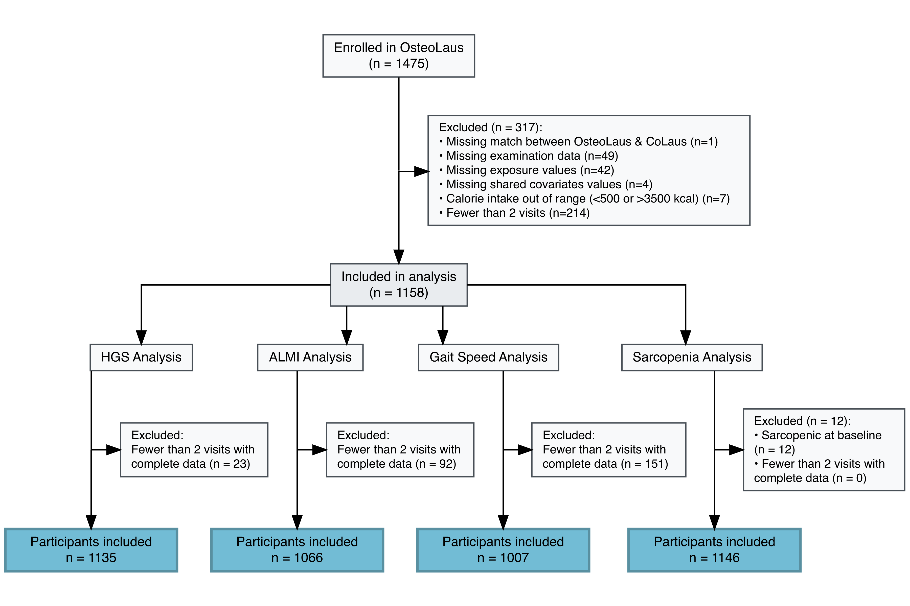

# Supplementary Material {#sec-supplementary .unnumbered}

<!-- ------------------------------------------------------------------ -->
<!-- SOURCE: ../04_manuscript/sections/07_supplementary_material.qmd    -->
<!-- ------------------------------------------------------------------ -->

## Directed Acyclic Graph (DAG) {#sec-dag}

<!-- Insert the DAG figure showing the assumed causal structure
     underlying the covariate selection. Generated by 02_scripts/DAG.R. -->

## Consort flow diagram {#sec-consort}

{#fig-consort width="90%"}

## Supplementary tables {#sec-sup-tables}

<!-- Add supplementary tables here (e.g., complete model results,
     alternative model specifications, full covariate list). -->

## Supplementary analyses {#sec-sup-analyses}

<!-- Describe any additional analyses not included in the main text. -->
